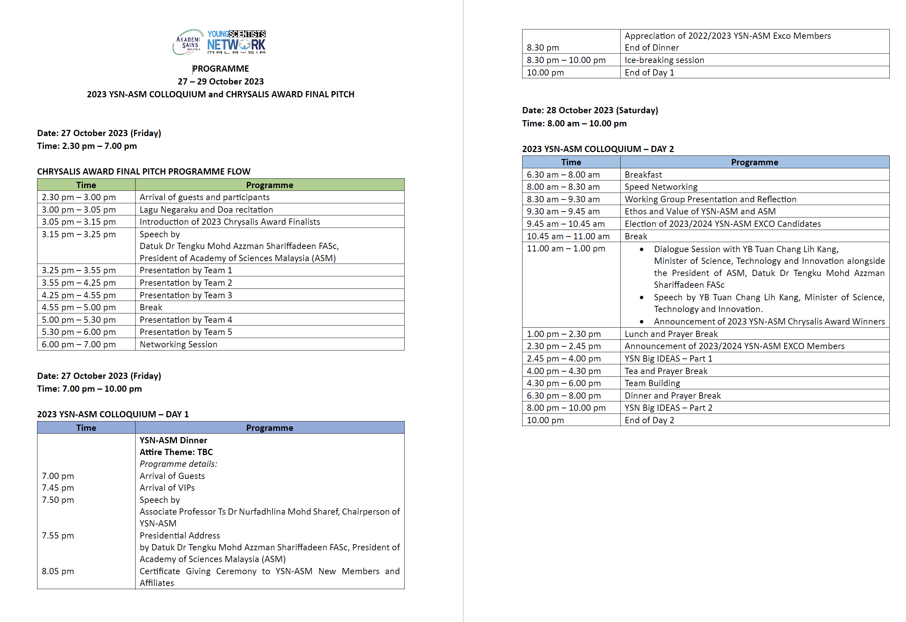

<a href="https://github.com/michaeltlp/gen_ai/stargazers"></a>
<a href="https://github.com/michaeltlp/gen_ai/network/members"></a>
<a href="https://github.com/michaeltlp/gen_ai"></a>
<a href="https://github.com/michaeltlp/gen_ai/issues"></a>
<a href="https://github.com/michaeltlp/gen_ai/graphs/contributors"></a>


# Image Analysis: ChatGPT

## 1. Download 2023 YSN-ASM COLLOQUIUM and CHRYSALIS AWARD FINAL PITCH schedule
You need to download the image to enable the document analysis process to be carried out. The document is:

<p align="center">
  
</p>

## 2. Upload file

1. Please upload the ysn-asm.png file in the chatgpt input box and enter the command 'explain'. 

2. The execution result is:

```
27 October 2023 (Friday)

Chrysalis Award Final Pitch Programme Flow (2:30 pm - 7:00 pm)

    2:30 pm - 3:00 pm: Arrival of guests and participants
    3:00 pm - 3:05 pm: Lagu Negaraku and Doa recitation
    3:05 pm - 3:15 pm: Introduction of 2023 Chrysalis Award Finalists
    3:15 pm - 3:25 pm: Speech by Datuk Dr Tengku Mohd Azzman Shariffadeen FASc, President of Academy of Sciences Malaysia (ASM)
    3:25 pm - 3:55 pm: Presentation by Team 1
    3:55 pm - 4:25 pm: Presentation by Team 2
    4:25 pm - 4:55 pm: Presentation by Team 3
    4:55 pm - 5:00 pm: Break
    5:00 pm - 5:30 pm: Presentation by Team 4
    5:30 pm - 6:00 pm: Presentation by Team 5
    6:00 pm - 7:00 pm: Networking Session

YSN-ASM Colloquium – Day 1 (7:00 pm - 10:00 pm)

    7:00 pm: Arrival of Guests
    7:45 pm: Arrival of VIPs
    7:50 pm: Speech by Associate Professor Ts Dr Nurfadhlina Mohd Sharef, Chairperson of YSN-ASM
    7:55 pm: Presidential Address by Datuk Dr Tengku Mohd Azzman Shariffadeen FASc, President of Academy of Sciences Malaysia (ASM)
    8:05 pm: Certificate Giving Ceremony to YSN-ASM New Members and Affiliates
    8:30 pm: Appreciation of 2022/2023 YSN-ASM Exco Members
    8:30 pm - 10:00 pm: Ice-breaking session
    10:00 pm: End of Day 1

28 October 2023 (Saturday)

YSN-ASM Colloquium – Day 2 (8:00 am - 10:00 pm)

    6:30 am - 8:00 am: Breakfast
    8:00 am - 8:30 am: Speed Networking
    8:30 am - 9:30 am: Working Group Presentation and Reflection
    9:30 am - 9:45 am: Ethos and Value of YSN-ASM and ASM
    9:45 am - 10:45 am: Election of 2023/2024 YSN-ASM EXCO Candidates
    10:45 am - 11:00 am: Break
    11:00 am - 1:00 pm: Dialogue Session with YB Tuan Chang Lih Kang, Minister of Science, Technology and Innovation alongside the President of ASM, Datuk Dr Tengku Mohd Azzman Shariffadeen FASc
        Speech by YB Tuan Chang Lih Kang, Minister of Science, Technology and Innovation
        Announcement of 2023 YSN-ASM Chrysalis Award Winners
    1:00 pm - 2:30 pm: Lunch and Prayer Break
    2:30 pm - 2:45 pm: Announcement of 2023/2024 YSN-ASM EXCO Members
    2:45 pm - 4:00 pm: YSN Big IDEAS – Part 1
    4:00 pm - 4:30 pm: Tea and Prayer Break
    4:30 pm - 6:00 pm: Team Building
    6:30 pm - 8:00 pm: Dinner and Prayer Break
    8:00 pm - 10:00 pm: YSN Big IDEAS – Part 2
    10:00 pm: End of Day 2
```
## Instructions
1. Please convert the following schedule into plain text with ASCII table formatting:

Certainly! Here's the schedule in plain text with ASCII table formatting:
```
27 October 2023 (Friday)
Chrysalis Award Final Pitch Programme Flow (2:30 pm - 7:00 pm)

|-------------------|------------------------------------------------------------------------------------|
| Time              | Programme                                                                          |
|-------------------|------------------------------------------------------------------------------------|
| 2:30 pm - 3:00 pm | Arrival of guests and participants                                                 |
| 3:00 pm - 3:05 pm | Lagu Negaraku and Doa recitation                                                   |
| 3:05 pm - 3:15 pm | Introduction of 2023 Chrysalis Award Finalists                                      |
| 3:15 pm - 3:25 pm | Speech by Datuk Dr Tengku Mohd Azzman Shariffadeen FASc,                           |
|                   | President of Academy of Sciences Malaysia (ASM)                                    |
| 3:25 pm - 3:55 pm | Presentation by Team 1                                                             |
| 3:55 pm - 4:25 pm | Presentation by Team 2                                                             |
| 4:25 pm - 4:55 pm | Presentation by Team 3                                                             |
| 4:55 pm - 5:00 pm | Break                                                                              |
| 5:00 pm - 5:30 pm | Presentation by Team 4                                                             |
| 5:30 pm - 6:00 pm | Presentation by Team 5                                                             |
| 6:00 pm - 7:00 pm | Networking Session                                                                 |
|-------------------|------------------------------------------------------------------------------------|

YSN-ASM Colloquium – Day 1 (7:00 pm - 10:00 pm)

|-------------------|------------------------------------------------------------------------------------|
| Time              | Programme                                                                          |
|-------------------|------------------------------------------------------------------------------------|
| 7:00 pm           | Arrival of Guests                                                                  |
| 7:45 pm           | Arrival of VIPs                                                                    |
| 7:50 pm           | Speech by Associate Professor Ts Dr Nurfadhlina Mohd Sharef,                       |
|                   | Chairperson of YSN-ASM                                                             |
| 7:55 pm           | Presidential Address by Datuk Dr Tengku Mohd Azzman Shariffadeen FASc,             |
|                   | President of Academy of Sciences Malaysia (ASM)                                    |
| 8:05 pm           | Certificate Giving Ceremony to YSN-ASM New Members and Affiliates                  |
| 8:30 pm           | Appreciation of 2022/2023 YSN-ASM Exco Members                                     |
| 8:30 pm - 10:00 pm| Ice-breaking session                                                               |
| 10:00 pm          | End of Day 1                                                                       |
|-------------------|------------------------------------------------------------------------------------|

28 October 2023 (Saturday)
YSN-ASM Colloquium – Day 2 (8:00 am - 10:00 pm)

|-------------------|------------------------------------------------------------------------------------|
| Time              | Programme                                                                          |
|-------------------|------------------------------------------------------------------------------------|
| 6:30 am - 8:00 am | Breakfast                                                                          |
| 8:00 am - 8:30 am | Speed Networking                                                                   |
| 8:30 am - 9:30 am | Working Group Presentation and Reflection                                          |
| 9:30 am - 9:45 am | Ethos and Value of YSN-ASM and ASM                                                 |
| 9:45 am - 10:45 am| Election of 2023/2024 YSN-ASM EXCO Candidates                                      |
| 10:45 am - 11:00 am| Break                                                                             |
| 11:00 am - 1:00 pm| Dialogue Session with YB Tuan Chang Lih Kang,                                      |
|                   | Minister of Science, Technology and Innovation                                     |
|                   | alongside the President of ASM, Datuk Dr Tengku Mohd Azzman Shariffadeen FASc      |
|                   | - Speech by YB Tuan Chang Lih Kang, Minister of Science,                           |
|                   | Technology and Innovation                                                          |
|                   | - Announcement of 2023 YSN-ASM Chrysalis Award Winners                             |
| 1:00 pm - 2:30 pm | Lunch and Prayer Break                                                             |
| 2:30 pm - 2:45 pm | Announcement of 2023/2024 YSN-ASM EXCO Members                                     |
| 2:45 pm - 4:00 pm | YSN Big IDEAS – Part 1                                                             |
| 4:00 pm - 4:30 pm | Tea and Prayer Break                                                               |
| 4:30 pm - 6:00 pm | Team Building                                                                      |
| 6:30 pm - 8:00 pm | Dinner and Prayer Break                                                            |
| 8:00 pm - 10:00 pm| YSN Big IDEAS – Part 2                                                             |
| 10:00 pm          | End of Day 2                                                                       |
|-------------------|------------------------------------------------------------------------------------|

```

2. Please create news related to the program in past tense
```
Here's a news article about the program in past tense:
Highlights from the 2023 YSN-ASM Colloquium and Chrysalis Award Final Pitch

The Young Scientists Network-Academy of Sciences Malaysia (YSN-ASM) successfully hosted its 2023 Colloquium and Chrysalis Award Final Pitch from 27 to 29 October 2023. The event brought together the brightest minds in science and innovation, creating an inspiring environment filled with intellectual vigor and collaborative spirit.
Day 1: Chrysalis Award Final Pitch

The first day of the event featured the highly anticipated Chrysalis Award Final Pitch. The program began at 2:30 pm with the arrival of guests and participants, followed by the national anthem and Doa recitation. The introduction of the 2023 Chrysalis Award Finalists set the stage for an afternoon of groundbreaking presentations.

Datuk Dr Tengku Mohd Azzman Shariffadeen FASc, President of the Academy of Sciences Malaysia (ASM), delivered a compelling keynote address. The afternoon continued with presentations from five finalist teams, each showcasing innovative projects and solutions. The session concluded with a networking event, allowing participants to connect and share ideas.
Day 1 Evening: YSN-ASM Colloquium

The evening session marked the commencement of the YSN-ASM Colloquium. The program included a welcoming speech by Associate Professor Ts Dr Nurfadhlina Mohd Sharef, Chairperson of YSN-ASM, followed by a presidential address by Datuk Dr Tengku Mohd Azzman Shariffadeen FASc. The ceremony honored new YSN-ASM members and affiliates, and recognized the contributions of the 2022/2023 YSN-ASM Exco Members. An engaging ice-breaking session concluded the first day.
Day 2: Intensive Colloquium Sessions

Day two featured a full schedule, beginning with breakfast and speed networking. Participants engaged in working group presentations and reflections, followed by a discussion on the ethos and values of YSN-ASM and ASM. The election of the 2023/2024 YSN-ASM EXCO candidates was a key highlight of the morning.

A dynamic dialogue session with YB Tuan Chang Lih Kang, Minister of Science, Technology and Innovation, headlined the mid-morning activities. This session included a speech by the Minister and the announcement of the 2023 YSN-ASM Chrysalis Award Winners.

After a lunch and prayer break, the afternoon featured the announcement of the new YSN-ASM EXCO Members and the first part of the YSN Big IDEAS series. The day continued with team-building activities and concluded with the second part of the YSN Big IDEAS series, wrapping up at 10:00 pm.
Reflecting on the Event

The 2023 YSN-ASM Colloquium and Chrysalis Award Final Pitch proved to be an enriching experience, fostering collaboration and innovation among Malaysia's young scientific community. The event highlighted the exceptional talent and dedication of the participants, setting a high standard for future gatherings.
```

Please create an [Issue](https://github.com/michaeltlp/gen_ai/issues) for any improvements, suggestions, or to report errors in the content.

[](https://visitorbadge.io/status?path=https%3A%2F%2Fgithub.com%2Fmichaeltlp)

